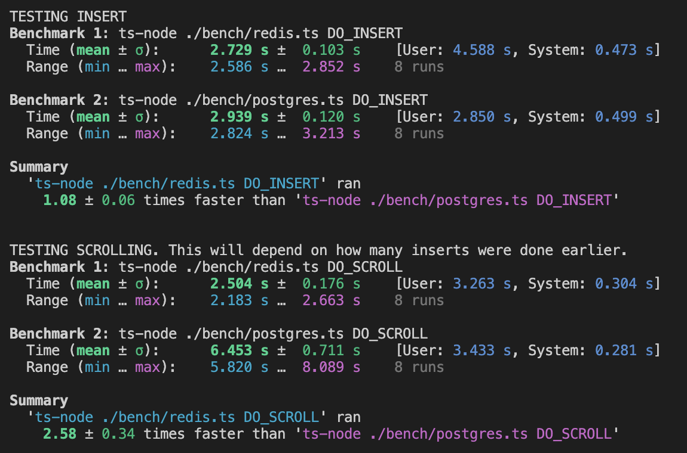
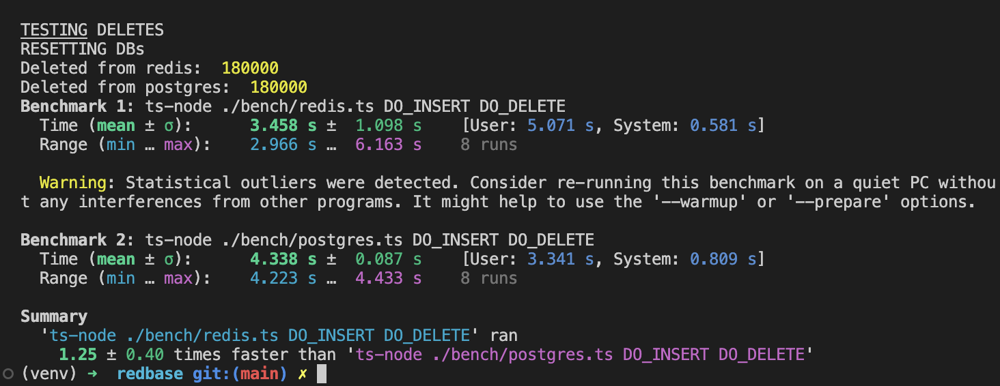

# Redbase

A simple, fast, indexed, and type-safe database on top of Redis. Can be used as a queryable, browsable cache.

## Goals

- **Simple**: less than 500 lines. Only one dependency, `ioredis`. No modules. You can copy-paste the code instead if you want.
- **Fast**: Compared to optimized Postgres, 150% faster at paginating unindexed data. See [all benchmarks](#benchmarks) below.
- **Indexable**: Supports hierarchical [tags](#tags), a lightweight primitive for indexing your data.
- **Browsable**: [browser-friendly API](#example-browsing-your-data) included for paginating and browsing by tag.

_Non-goals_

- No dependencies on Redis modules. Useful for deploying on platforms like [Upstash](https://upstash.com/).
- Never queries "KEYS" on your redis instance, which is expensive. Uses simple [set theory](https://github.com/alexanderatallah/redbase/blob/main/src/redbase.ts#L445) and data structures to implement query logic.

In a few lines:
```ts
import { Redbase } from 'redbase'
const db = new Redbase<MyDataType>('my-project')
const value = await db.get(id) // type: MyDataType
```

Exploration API:
`npm run server`

[![npm package][npm-img]][npm-url]
[![Downloads][downloads-img]][downloads-url]
[![Issues][issues-img]][issues-url]
[![Code Coverage][codecov-img]][codecov-url]
[![Commitizen Friendly][commitizen-img]][commitizen-url]
[![Semantic Release][semantic-release-img]][semantic-release-url]

- [Redbase](#redbase)
  - [Goals](#goals)
  - [Install](#install)
  - [Usage](#usage)
  - [Core concepts](#core-concepts)
    - [Entries](#entries)
    - [Tags](#tags)
    - [Example: Prompt Cache](#example-prompt-cache)
    - [Example: Browsing Your Data](#example-browsing-your-data)
  - [Benchmarks](#benchmarks)
    - [For the cache use-case](#for-the-cache-use-case)
    - [For the database use-case](#for-the-database-use-case)
    - [Results](#results)
  - [License](#license)

## Install

```bash
npm install redbase
```

## Usage

```ts
import { Redbase } from 'redbase'

// Can use strings, numbers or buffers as well
type MyValue = {
  a: string
  b?: {
    c: string
  }
}

// Options can also use your own ioredis instance if already defined,
// as `redisInstance`
const db = new Redbase<MyValue>('myProject', { redisUrl: 'redis://...' })

const key = uuid()
const value = { a: 'result' }

await db.get(key) // undefined

await db.set(key, value)

await db.get(key) // value

// Type safety!
await db.set(key, { c: 'result2' }) // Type error on value

// Browsing results
let data = await db.filter()
assertEqual(data, [{ id: key, value }])
assertEqual(await db.count(), 1)

// Hierarchical indexes, using a customizable tag separator (default: '/')
await Promise.all([
  // Redis auto-pipelines these calls into one fast request!
  db.set(uuid(), { a: 'hi' }, ['user1/project1']),
  db.set(uuid(), { a: 'there' }, ['user1/project2']),
  db.set(uuid(), { a: 'bye' }, ['user2/project1'])
])

data = await db.filter()
assertEqual(data.length, 4)

// WHERE queries, using tag names
data = await db.filter({ where: 'user1'})
assertEqual(data.length, 2)

// AND and OR queries:
data = await db.filter({ where: {OR: ['user1', 'user2']}})
assertEqual(data.length, 3)

const count = await db.count({ where: {OR: ['user1', 'user2']}})
assertEqual(count, 3)

// See all your indexes:
const tags = await db.tags("user1")
assertEqual(tags.length, 2)

// Clear just parts of the database:
const numberDeleted = await db.clear({ where: 'user2' })
assertEqual(numberDeleted, 1)
```

For all functionality, see `test/database.spec.ts`.

## Core concepts

There are two main concepts in Redbase: entries and tags. This section explains them and then provides example code combining both.

### Entries

An entry is composed of an `id` and a `value`:
- Values are type-checked, but schemaless.
- IDs are strings. You are in charge of creating them, e.g. by hashing your value, making a UUID, using some external id, etc.
- If you have a non-string key that you want to use with your value (as is the case when you're storing prompts + completions), you can combine them into one value type. See [the prompt cache example](#example-prompt-cache) below.

### Tags

Tags are a lightweight primitive for indexing your values. You attach them at insert-time, and they are schemaless. This makes them simple and flexible for many use cases. It also allows you to index values by external attributes (that aren't a part of the value itself: [example](#example-prompt-cache)).

Calling `db.filter({ where: { AND: [...]}})` etc. allows you to compose them together as a list.

Tags are sort of self-cleaning: indexes delete themselves during bulk-delete operations, and they shrink when entries are deleted individually. However, when the last entry for an index is deleted, the index is not. This shouldn't cause a significant zombie index issue unless you're creating and wiping out an unbounded number of tags.

Tags can get unruly, you you can keep them organized by nesting them:
`parentindex/childindex`. This effectively allows you to group your indexes, and makes [browsing](#example-browsing-your-data) your data easier and more fun.

Call `db.tags("parentindex")` to get all the children tags.

As you might expect, when indexing an entry under `parentindex/childindex` the entry is automatically indexed under `parentindex` as well. This makes it easy to build a url-based [cache exploration server](#example-browsing-your-data). Call `db.filter({ where: 'parentindex' })` to get all entries for all children tags.


### Example: Prompt Cache

Sample code for setting up the prompt cache for a large language model (LLM), like [OpenAI](https://platform.openai.com/docs/introduction):

```ts
import { CreateCompletionRequest, CreateCompletionResponse, OpenAIApi } from 'openai'

export const CACHE_NAME = 'promptCache'
const CACHE_EXPIRATION = 60 * 60 * 24 * 7 * 4 * 2 // 2 months

export type PromptQuery = CreateCompletionRequest
export type PromptResult = CreateCompletionResponse
export type PromptEntry = { prompt: PromptQuery, completion: PromptResult }
export const promptCache = new Redbase<PromptEntry>(CACHE_NAME, { defaultTTL: CACHE_EXPIRATION })
```

Now, you can cache and index your prompts by doing this:

```ts
// Tags can include metadata that isn't present in the value itself.
const tags = [
  `user-${user || ""}`,
  `url-${encodeURIComponent(url)}/leaf-${leafNumber}`
]
const payload = { ...requestData, user }
const response = await openai.createCompletion(payload)
await promptCache.save(id, {
  prompt: requestData,
  completion: response.data
}, { tags })
```

### Example: Browsing Your Data

To browse, paginate, filter, and delete your data directly from a browser, just fire up the API:

`npm run server`


## Benchmarks

**Note:** I'm very new to benchmarking open-sourced code, and would appreciate pull requests here! One issue, for example, is that increasing the number of runs can cause the data to scale up (depending on which benchmarks you're running), which seems to e.g. make Redis win on pagination by a larger margin.

This project uses [hyperfine](https://github.com/sharkdp/hyperfine) to compare Redis in a persistent mode with Postgres in an optimized mode. **Yes, this is comparing apples to oranges.** I decided to do it anyway because:

1. A big question this project answers is "how can I have a queryable, browsable db that also works well as a cache?" Redis and Postgres are two backend choices that pop up frequently.

2. Not many people seem to know that Redis has an append-only file (AOF) persistence option. I heard about this and was curious to see how it performed.

3. I wanted to compare with an on-disk database solution to get a sense of where the advantage lies for using a persistent, in-memory database as a primary database.

All that said, the benchmarks put Redis and Postgres in [roughly equivalent persistence settings](http://oldblog.antirez.com/post/redis-persistence-demystified.html), which you can play with:

- Redis is set up using `SET appendfsync everysec`, which issues `fsync` calls between 0 and 2 seconds.

- Postgres is set up using `SET synchronous_commit=OFF`, which delays writing to WAL by 0.6 seconds.

These settings were chosen because they somewhat balance the speed needs of a cache with the durability needs of a database. To use one or the other:

### For the cache use-case
Comment-out the Redis config lines in `setupRedis` in `/bench/redis`. Similarly configure your project's Redis setup, of course, though it's the Redis default.

### For the database use-case
Comment-in the Redis config line `redis.config('SET', 'appendfsync', 'always')` in `/bench/redis.ts`. Similarly configure your project's Redis setup, of course.

Comment-out the call to `ALTER DATABASE ... SET synchronous_commit=OFF;` in `/bench/postgres.ts`. This reverts to the default (fully-persistent) Postgres setting.

### Results
- **Inserting data**: Tie
- **Paginating unindexed data**: Redis is ~150% faster
- **Single-index pagination**: Postgres is ~50% faster
- **Joint-index pagination**: Postgres is ~60% faster
- **Inserting and deleting data**: Redis is ~25% faster

Results on Apple M1 Max, 2021:




## License
MIT

[build-img]: https://github.com/alexanderatallah/redbase/actions/workflows/release.yml/badge.svg
[build-url]: https://github.com/alexanderatallah/redbase/actions/workflows/release.yml
[downloads-img]: https://img.shields.io/npm/dt/redbase
[downloads-url]: https://www.npmtrends.com/redbase
[npm-img]: https://img.shields.io/npm/v/redbase
[npm-url]: https://www.npmjs.com/package/redbase
[issues-img]: https://img.shields.io/github/issues/alexanderatallah/redbase
[issues-url]: https://github.com/alexanderatallah/redbase/issues
[codecov-img]: https://codecov.io/gh/alexanderatallah/redbase/branch/main/graph/badge.svg
[codecov-url]: https://codecov.io/gh/alexanderatallah/redbase
[semantic-release-img]: https://img.shields.io/badge/%20%20%F0%9F%93%A6%F0%9F%9A%80-semantic--release-e10079.svg
[semantic-release-url]: https://github.com/semantic-release/semantic-release
[commitizen-img]: https://img.shields.io/badge/commitizen-friendly-brightgreen.svg
[commitizen-url]: http://commitizen.github.io/cz-cli/
